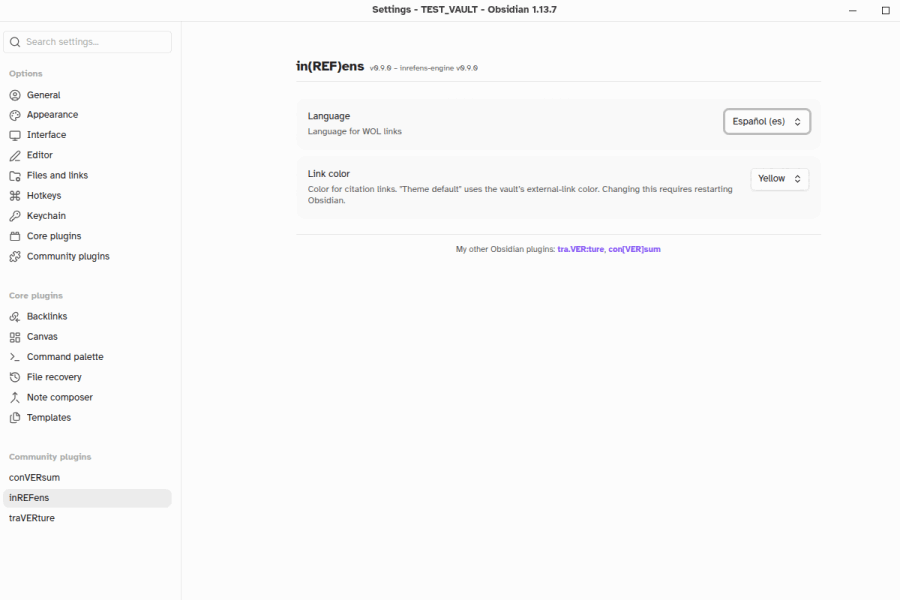

 

# in(REF)ens – Obsidian plugin

> **inrefens** (n.): The ongoing act of bringing a publication reference into the text — of adducing a cited source and binding it to the note. From Latin *in-* ("into") + *referre* ("to carry back, to refer") + *-ens* (present participle).

A publication citation parser and linker for Obsidian. Find references to publications of Jehovah's Witnesses and link them to [wol.jw.org](https://wol.jw.org/). *Inferre et ligare* ("To bring in and bind").

## Security and Privacy

See [SECURITY](https://github.com/erykjj/inrefens?tab=security-ov-file).

---

## Features

- **Automatic citation detection** – Publication citations are automatically detected in both Reading View and Live Preview (Edit mode), and updated as you type. Recognized roots include *The Watchtower* (`w`, `ws`, `wp`), *Awake!* (`g`), *Kingdom Ministry* (`km`), *Meeting Workbook* (`mwb`), *Insight on the Scriptures* (`it-1`, `it-2`), and hundreds of books, brochures, tracts, and online article series

- **Interactive links** – Every detected citation becomes a clickable link. Clicking opens the result of the search for the citation on [*wol.jw.org*](https://wol.jw.org)

- **Flexible citation forms** – Accepts a wide range of user-written variants:
  - Glued or separated years: `w15 2/15`, `w 15 2/15`, `w2015 2/15`, `w 4/2026`
  - Month/day in either order: `w15 2/15`, `w15 15/2`
  - Optional page ranges: `w26.4 12-15`, `be 30-32`
  - Hyphenated or non-hyphenated roots: `it-1 450`, `it1 450`
  - Titles in reference works: `it-1 Abraham`, `it-1 "Abraham"`

- **Multi-language support** – Links open in your chosen language on *wol.jw.org*.
  - Supported languages: ASL, Cebuano, Chinese (Simplified Mandarin), Danish, Dutch, English, Estonian, Finnish, French, German, Haitian Creole, Hungarian, Italian, Japanese, Korean, Norwegian, Polish, Portuguese (Brazil and Portugal), Romanian, Russian, Spanish, Swedish, Tagalog, Ukrainian

- **Configurable link color** – Choose from presets or enter a custom hex value; changing the color requires restarting Obsidian

- **Desktop and mobile support**

---

## Settings

- **Language** – Language for *wol.jw.org* links
- **Link color** – Color for citation links; "Theme default" uses the vault's external-link color; presets and a custom hex option are provided; changing this requires restarting Obsidian

---

## Known Limitations

- In Edit mode, a citation that includes markup (e.g. `*wp16.5* 13`) renders as adjacent links rather than one link (Obsidian limitation); however, each link contains the URL for the whole citation

- A bare `it` (without `-1` or `-2`) is not linked; *Insight on the Scriptures* has two volumes, and the volume must be specified to disambiguate; otherwise, the root would be too open to false positives (e.g. "it 'a house'")

- Straight single quotes (`'...'`) are not accepted as title delimiters for `it-1` and `it-2` citations; use straight double quotes (`"Eliab"`), curly quotes (`“Eliab”` or `‘Eliab’`), or guillemets (`«Eliab»`)

- If you encounter a publication root that doesn't link, please [open an issue](https://github.com/erykjj/inrefens/issues)

---

## Performance

Detection runs on visible text only and is fast even on large documents. Changing the language in settings reloads the parsing engine, which may take a moment on mobile.

---

## Installation & Updating

1. In your vault's `.obsidian/plugins/` directory, make a directory (folder) called `inrefens`, if you don't already have one
2. Download [main.js](https://github.com/erykjj/inrefens/releases/latest/download/main.js), [styles.css](https://github.com/erykjj/inrefens/releases/latest/download/styles.css), [manifest.json](https://github.com/erykjj/inrefens/releases/latest/download/manifest.json)
3. If not already enabled, enable `in(REF)ens` in Obsidian Settings → Community plugins
4. Configure the language in the plugin settings (if installing for the first time); defaults to English

---

## Feedback, etc.

Feel free to get in touch and post any [issues and/or suggestions](https://github.com/erykjj/inrefens/issues).

My other Obsidian plugins:

- **con[VER]sum**: [GitHub repo](https://github.com/erykjj/conversum), [Obsidian Community](https://community.obsidian.md/plugins/conversum)
- **mu/TEX/tum**: [GitHub repo](https://github.com/erykjj/mutextum), [Obsidian Community](https://community.obsidian.md/plugins/mutextum)
- **tra.VER:ture**: [GitHub repo](https://github.com/erykjj/traverture), [Obsidian Community](https://community.obsidian.md/plugins/traverture)